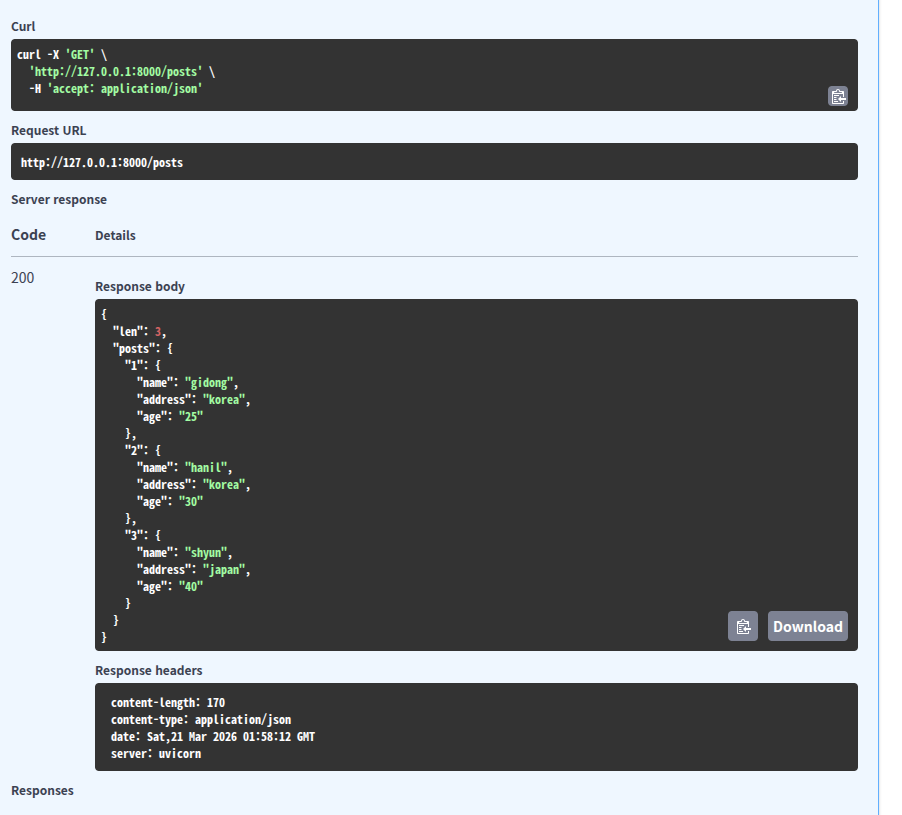
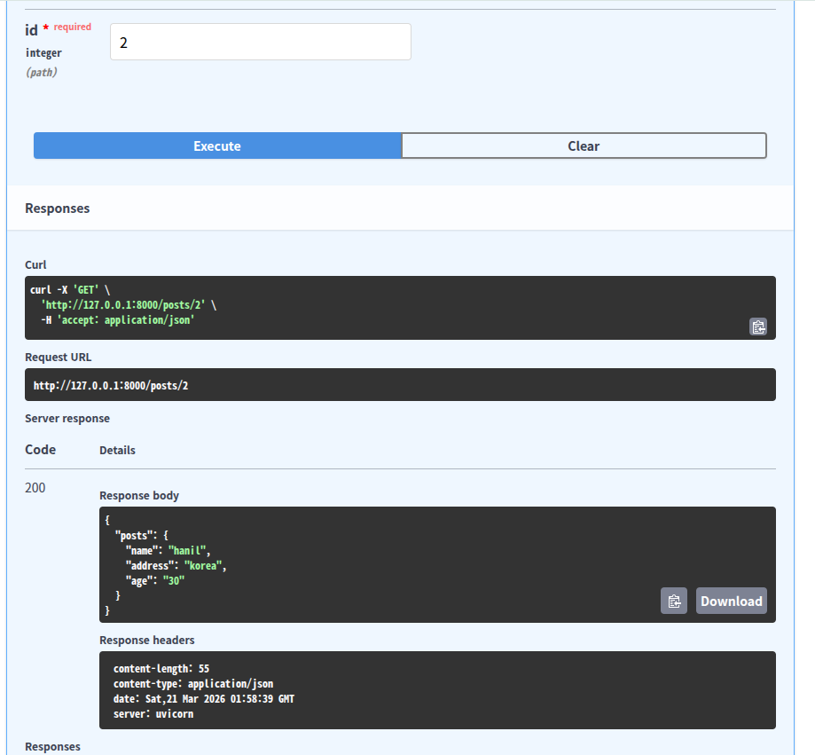

# FastAPI
FastAPI is a Python framework that makes it easy and fast to build REST API servers.  
* REST API(Representational State Transfer) : it is a rule and standard to send and received data on Web  
- use http method :  
  GET : retrieve  
  POST : generate  
  PUT : edit all  
  PATCH : edit part  
  DELETE : delete  
- use URL as resource
- Stateless : server process each request independently
- JSON : a way to transfer data between server and client
  
# Decorator @
it wraps a functin and class
-> so if they get certain request, below function execute

# pydantic
```
from pydantic import BaseModel
class Post(BaseModel):
  title : str
  content : str
  author : str
```
- Automatically validates incoming data so you don’t have to manually check each field.
- Makes your code cleaner and easier to maintain.
- Works well with FastAPI’s automatic docs (/docs) because it knows the data structure.

# Reuslt
- get all of data I did post

- get one specific post using id number



# Error
- do not give the same names to function and dictionary
```
TypeError : 'function' obejct does not support item assignment
```


