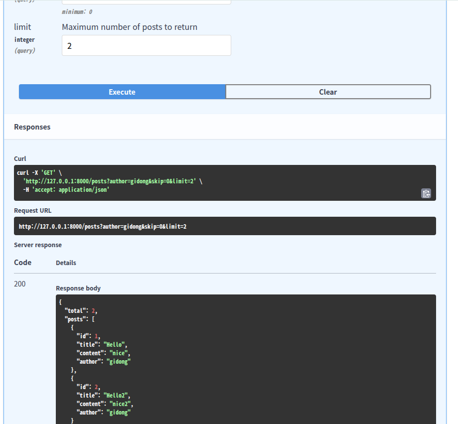
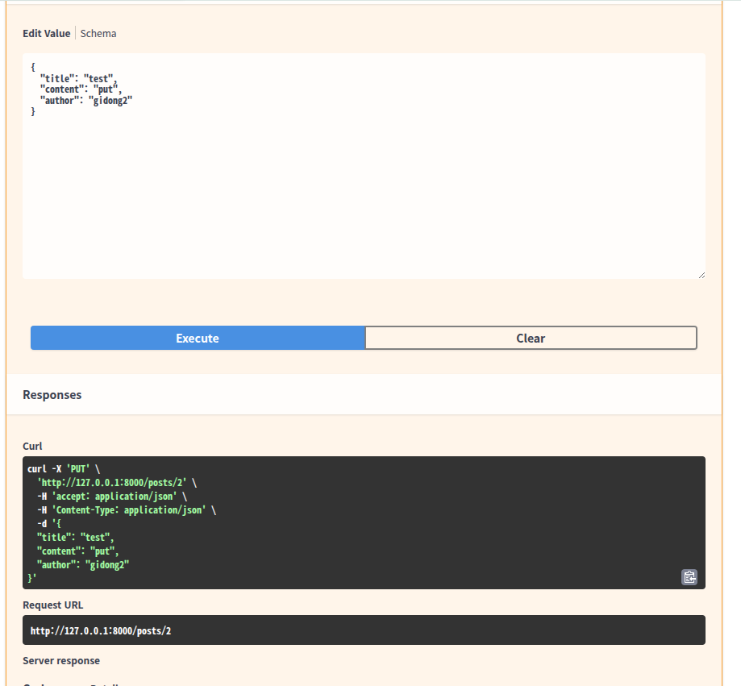
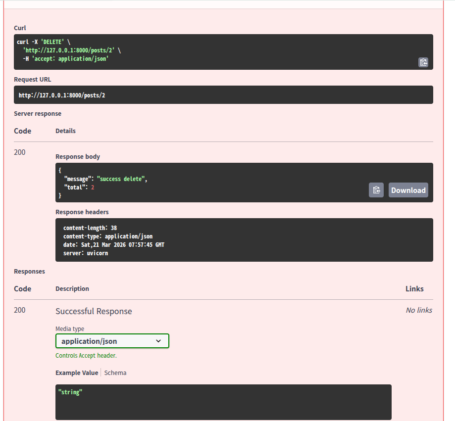

# Path Parameter & Query Parameter
- path parameter : Necessary to include in the URL to retrieve a specific piece of data.
```
def get_data( author : str) <- author should put in
```
- query parameter : Optional values that come after "?" in the URL. If the user doesn’t provide them, the API can use default values.
```
def get_data(author : str = "None") <- authour can't necessarily put in
```

# Reuslt
- parameter

- query 


# Query and Optional
- both are needed for validating the data
- if we don't use optional, it would be error to put None as default because str and None have different types
- Query is also helping generate filtering and do validation check, set default
```
author : Optional[str] = Query(None, description = "")
```
for example
skip and limit
```
ge : greater than or equal
gt : greater than
le :less than or equal
lt : less than
```

! **v means unrap v


# Mini project
make a board to post,edit and delete freely using PUT,GET,POST,DELETE

- retreive data using filter


- edit specific data

- delete data

