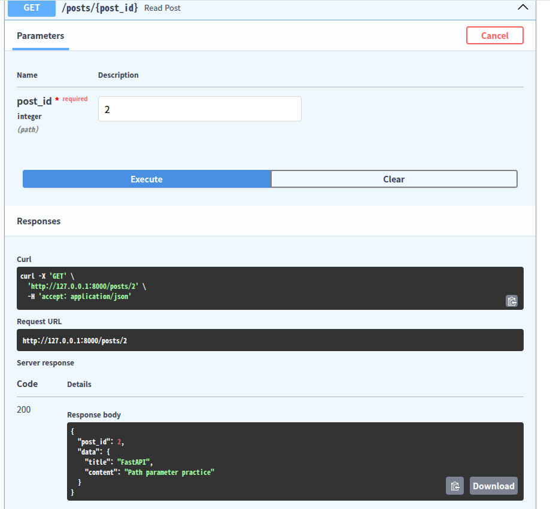
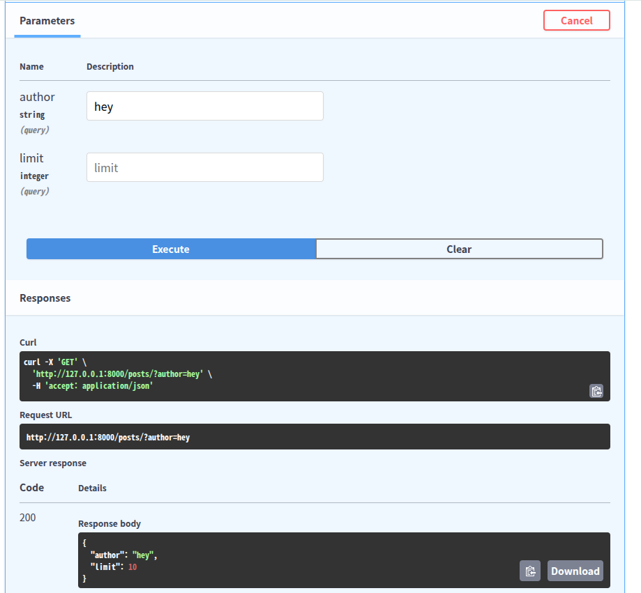

# Path Parameter & Query Parameter
- path parameter : Necessary to include in the URL to retrieve a specific piece of data.
```
def get_data( author : str) <- author should put in
```
- query parameter : Optional values that come after "?" in the URL. If the user doesn’t provide them, the API can use default values.
```
def get_data(author : str = "None") <- authour can't necessarily put in
```

# Reuslt
- parameter

- query 

